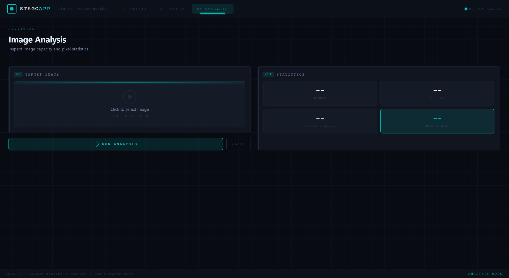
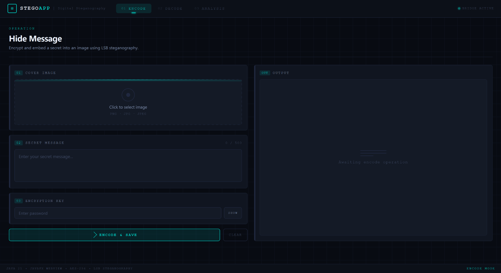
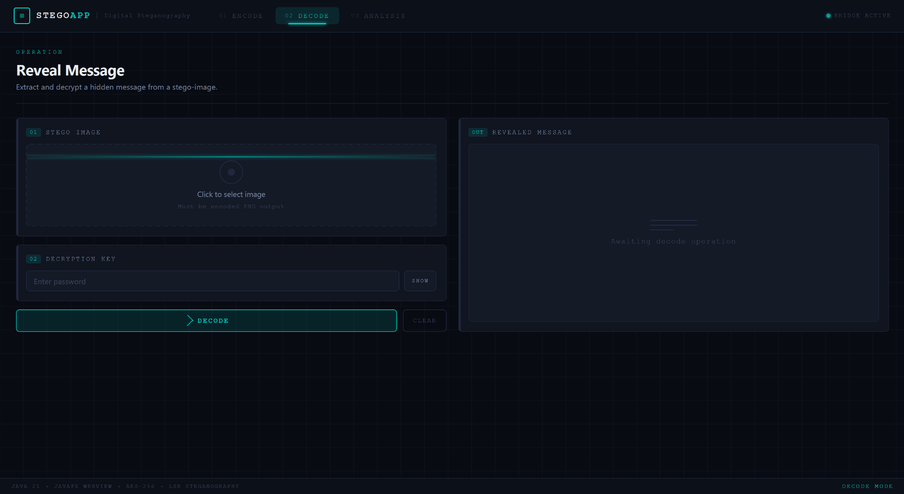

# StegoApp

This is a minimal, Linux-focused setup and run guide for the JavaFX-based steganography project.

---

## Requirements

- OpenJDK 21 (LTS)
- unzip / tar
- bash

### Install JDK (Debian/Ubuntu)
```
sudo apt update
sudo apt install openjdk-21-jdk
```

### Verify
`java -version`

---

## JavaFX Setup

JavaFX is not bundled with OpenJDK.

1. Download SDK (NOT jmods):
   `https://gluonhq.com/products/javafx/`

2. Extract:
   `unzip openjfx-21_linux-x64_bin-sdk.zip`

3. Move into project:
   ```bash
   mkdir -p lib
   mv javafx-sdk-21 lib/javafx-sdk
   ```

Expected layout:
`lib/javafx-sdk/lib/*.jar`

---

## Project Structure

src/
resources/
lib/javafx-sdk/lib/
run.sh

---

## Running the App (Linux)

Make script executable:
`chmod +x run.sh`

Run:
`./run.sh`

Options:
1 -> compile + run  
2 -> clean build + run  
3 -> build portable JAR  

---

## Manual Compile (for debugging)

```
javac \\
  --module-path lib/javafx-sdk/lib \\
  --add-modules javafx.controls,javafx.fxml,javafx.web \\
  -d out \\
  src/module-info.java \\
  src/core/Main.java

#Run:
java \\
  --module-path lib/javafx-sdk/lib \\
  --add-modules javafx.controls,javafx.fxml,javafx.web \\
  -cp "out:resources" \\
  core.Main
```

---

## Build JAR (manual)

```
./run.sh # -> option 3

# Run JAR:
java \\
  --module-path path/to/javafx-sdk/lib \\
  --add-modules javafx.controls,javafx.fxml,javafx.web \\
  -jar StegoApp.jar
```

---

## Windows Setup

### Requirements

- Windows 10/11
- OpenJDK 21 (LTS)
- Command Prompt (cmd)

---

### Install JDK

Download and install OpenJDK 21 from:
https://adoptium.net/

Verify installation:
```bat
java -version
```

---

## JavaFX Setup (Windows)
- Download JavaFX SDK (NOT jmods):
`https://gluonhq.com/products/javafx/`

- Extract the ZIP file
- Move it into the project:

```bat
mkdir lib
move javafx-sdk-21 lib\javafx-sdk
```

---

## Running the App

Double click `run.bat`

Or run from the Command prompt: `run.bat`

---

## Common Failures

Missing JavaFX modules:
- Check module path points to lib/javafx-sdk/lib

WebView not found:
- Wrong download (must be SDK, not jmods)

Blank UI:
- resources not copied or classpath missing

---

## Screenshots

### Input & Upload
Upload an image and provide the message to be hidden.


### Encoding Process
The message is encrypted and embedded into the image using LSB encoding.


### Decoding Process
Extract and decrypt hidden data from an encoded image.


---
